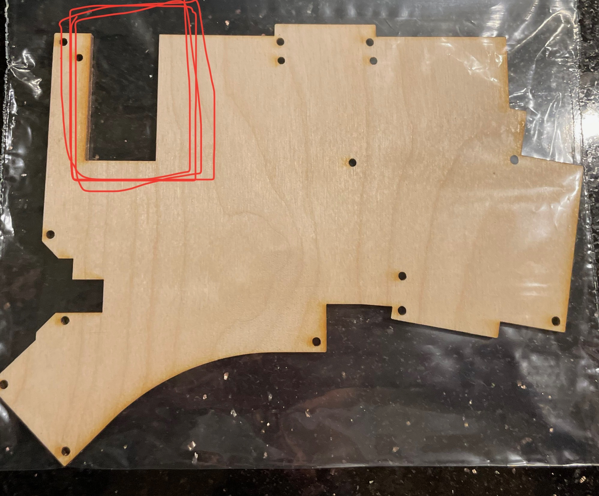

# Klory
A variation of the Klor keyboard by GEIGEIGEIST (https://github.com/GEIGEIGEIST/KLOR).

***

## Introduction

This is a guide to my experiences buiding Klory, my variant of the Klor keyboard. This was my first keyboard build and GEIST did an outstanding job
documenting the build process in the GitHub repository. The changes I made were mainly due to my inexperince. Some were just personal preference 
differences.

Spoiler alert! I love Klory and am buiding a second for home.

## Thanks!

Of course, thanks to GEIST for making such a great keyboard. 

- Thanks to Char for leading me down the mechanical keyboard rabbit hole. 
- Thanks to Peter B. for help soldering diodes and hot swap sockets. 
- Thanks Harlan for expertise in all things maker. 

## Why the Klor?

I was using a Planck Ez. I had changed the keymap to a 3x5 layout in which I was not using the center 6 keys above the spacebar. I was using the equivalent of four (4) thumb keys in my layout. However, I felt that my thumbs were cramped as they had to fold under my hand to get to some of the keys.

I really liked the Planck Ez, but then I started wanting a split keyboard. I originally looked for a split Planck, but then I thought column
stagger would be great and more room for my thumbs. I really liked the Corne, but I was using four thumb keys.

Therefore, the main reasons for the Klor were:
- four thumb keys
- thumb keys not requiring folding thumb under hand
- thumb keys in a curve

There were several nice to haves:
- encoder support
- the option of moving the pinkie out for the Q and P key instead of up.
- KB2040 support
- trackball support

I really wished the trackball was still for sale.

I was not interested in:
- OLED
- haptic feedback
- sound

These options did not seem that useful. Also, not all of the firmwares supported these different options.

I decided to built a wired Polydactyl using the Adafruit KB2040 without LEDs.

## Decisions

### Polydactyl

As I mentioned before, I picked the Klor for the four thumb keys. I was originally planning to build the Yubitsume layout without the extra pinkie keys. However, I was finding the pinkie reach to the P and the Q was not ideal. So, I decided to leave these keys on and experiment with using those keys as alternate pinkie keys. I have not started using these keys yet. Currently, I'm not interested in using these to give the pinkie more keys like return and delete etc. I'm more interested in fewer keys.

### LEDs

I really wanted the per key LEDs and partially decided on a wired solution to get the LEDs. However, after the initial excitment of having LEDs on the 
Planck, I decided that it didn't have a lot of value. I could't even see the leds in the lighting at work. I also wasn't sure which LEDs to order.

### Choc switches

The only negative at this point was that I wanted low profile Choc switches. I spent time looking for an alternative to the Klor that was low profile.
There were some teasers that there might be a low profile Choc variant. However, this did not seem likely or to happen in the timeframe I was willing to wait. I ended up decided that using MX switches allowed me to use the MX DSA keycaps that I had purchased for the Planck. I'm really happy that I went with MX switches because it gave me much more flexibility to test switches on the Planck.

### Why wired?

As a first build, I thought that a wired solution would be easier to debug and would have less failure modes. It would also work with QMK which I was used to using with the Planck. In addition, there were more options for MCUs and they would be cheaper.

There are cases where the right keyboard stops communicating with the left. Since, the keyboards are wired, I can just unplug them. I use a magnetic USB adapter so this is super easy to do. 

### KB2040

I decided to use the KB2040 from Adafruit. I picked it because it was cheap and and seemed very versatile. It worked with CircuitPython, C++, and Rust. It also had extra connectors, debug pins, LEDs, and reboot/reset buttons. It would be a great MCU for other projects if the keyboard didn't work out.

***

## Parts

Information about the parts I used and where I bought them is on the [Parts page](pages/Parts.md).

## Build

Details about building my Klor keyboard are on the [Build page](pages/Build.md).

### PCB

A ordered the PCB from [JLCPCB](https://jlcpcb.com). It was by far the cheapest option. I ordered the PCB in green instead of black as it would shorten
the build time by 2 days. I asked the support on JLCPCB if this would be okay and they said that it would.

The minimal order was 5 pcbs. I did not like the idea of having enough PCBs for 2.5 keybaords. I did some mockups in KICAD to see if I could get two PCBs
on a single file, but the cost ended up being the same as ordering 10 pcbs. So, I went with the standard PCB. 

The first PCB I soldered didn't work completely correctly. All the keys worked, except for the thumb keys. They would register as all of the keys in the
row and not just the thumbkey. I did a lot of debugging. All of the diodes were correct as far as I could determine. There is a possibility that it is a 
grounding issue. So, in the end the extra PCB turned out to be a good idea. I built too complete keyboards from the other four PCBs.

|  |
|:--:| 
| *Bare PCB* |

### Diodes and Kaihl Sockets

Soldering the diodes and the sockets was fairly easy. For the diodes, I would put down a little flux, put solder on the iron, and bring the solder to the
diode while holding it down with tweezers. Sockets were done in the same way. They sockets are easier in that they sit nicely in the holes on the board. I
still pushed down on them with the tweezers just to make sure they were flush.

The circuit board is printed to show the correct location for the sockets and the correct direction for the diodes. This is a big help.

|  |
|:--:| 
| *The diodes are really small!* |

|  |
|:--:|
| *Here is the PCB with diodes soldered to it.* |

|  |
|:--:|
| *Now the PCB has the Kaihl switch sockets soldered to it.* |

### MCU

The original design of the Klor has the MCU mounted to the bottom of the circuit board. The case designs have a cut out for the MCU to hang down. I didn't
really like this design. I wanted the MCU to be better protected. I also wanted to be able to access the boot and reset buttons on the KB2040.

|:--:| 
| *This is the laser cut buttom plate of the original case (in wood) showing the cut out for the MCU.* | 

I started playing around in KiCAD to figure out how to mount the MCU on the top. However, the MCU is actually mounted right side up to the bottom of the
keyboard. This means that the circuit board does not need to be redesigned to mount the MCU to the top. You just put the sockets on the top of the board.

Since the board is double sided there are two possible locations for the sockets. I put the sockets on the bottom of the board like the original build
directions say. I would then look at the top of the board to see where the pins would poke through. Then I would switch the socket to the top of the board
and solder it into place.

Mounting the MCU to the top of the PCB meant that the original cases would need to be redesigned. 

After mounting the MCU to the top of the board, I discovered that having the MCU mounted right side up to the bottom of the PCB is a normal design. One
of my co-workers has a keyboard with a similar design.

|  |
|:--:| 
| *Showing the MCU attached to the socket on the left and the MCU sockets on the right.* |

After attaching the MCU, you can insert some switches and make sure everything is working. For a couple of the PCBs, I had to resolder a couple of the
sockets to get a better connection.

|  |
|:--:|
| *Testing the switches* |

### TRRS

I did not want to use the typical microphone/headset cable for communication between the keyboard halfs. I don't have a great reason for this, but I don't
like using a connector for a different purpose. There is also the case that as you pull the cable out power could be sent through one of the other
wires in the cable. The chance of that is most likely pretty small, but still it seems a little hacky.

I decided to use the JST-SH Connector. These things are crazy small and I couldn't solder wires to them at all. They really need a breakout board. :-(

|  |
|:--:|
| *Small JST-SH Connector* |

I'm not sure what I'm going to use instead. I might go back to the microphone/headset style cable. I'm also looking at magnetic connectors that Adafruit
sells, but they are fairly big. [Magnetic connectors](https://www.adafruit.com/product/5358)

I also did not like where the TRRS socket was mounted. While the mounting location is typical of most split keyboards, I want to have my mouse between
the keyboard halves and felt like the original location had the cable coming out into the area where my mouse should be. I decided to use wires to route
the socket to come out under the MCU in the same location as the USB connector. I feel like this is a much better location. 

Currently, the two halfs of both of my keyboards are hardwired. It is not very elegant, but it works.

My original plan for my first keyboard was to solder wires to the TRRS pads. These were going to be soldered to the bottom of the PCB because that is
where the TRRS jacks are mounted and the wires also need to be out of the way of the encoders. I then was going to solder these wires to the JST-SH
connector under the MCU. However, the wires need to get to the other side of the board.

So, I **drilled holes** in the board to make this happen! That was rather scary. It looks pretty cool though. :-)

However, there is a cutout in the PCB for the USB socket to sit. For the second build, I decided I could route the wires through this cutout instead of
drilling holes in the PCB. That seems like a much better idea.

|  |
|:--:|
| *Wires soldered to TRRS pads and holes for wires in PCB* |

|  |
|:--:|
| *Wires soldered to TRRS pads* |

|  |
|:--:|
| *Hard wired halves top view* |

|  |
|:--:|
| *Hard wired halves bottom view* |

Notice that the cable between the halves goes up and over to the other half. It is out of the way of where the mouse would be. I think this change is
great. It will be even better when I have a connector and it isn't hard wired.

